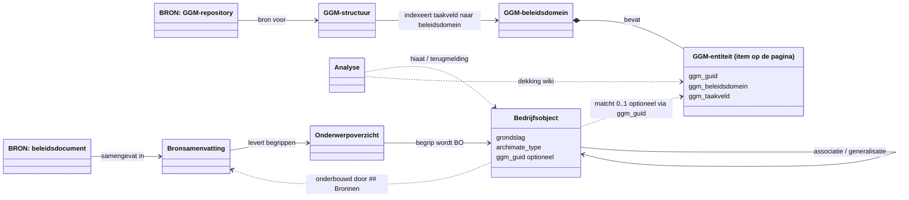

# Informatiemodel van de wiki

Dit is het **meta-model van de wiki zelf**: welke soorten pagina's er zijn, welke informatie ze dragen, en hoe ze onderling en met het GGM samenhangen. Het beschrijft niet het bedrijfsobjectenmodel (dat staat in [Wiki/Bedrijfsobjecten/](Wiki/Bedrijfsobjecten/)), maar de structuur waarmee dat model wordt opgebouwd en herleidbaar gehouden.

Het document beschrijft de **doelstaat**. Twee dingen wijken af van de huidige mappenstructuur en worden binnenkort doorgevoerd:

1. **GGM verhuist van `Sources/` naar de wiki.** Het JSON-bestand [`Sources/GGM-repository/ggm_parsed.json`](Sources/GGM-repository/ggm_parsed.json) blijft de bron; de leesbare GGM-representatie wordt een wiki-paginatype onder `Wiki/GGM/`.
2. **"Domein" heet voortaan "onderwerp"** (consistent met [`Sources/Onderwerpen/`](Sources/Onderwerpen/)); het paginatype *domeinoverzicht* wordt *onderwerpoverzicht*. Het GGM houdt zijn eigen term **beleidsdomein**. De tekstdoorwerking in `CLAUDE.md`, templates en bestaande pagina's is een nog uit te voeren vervolgtaak.

---

## 1. Doel en scope

De wiki bouwt het GEMMA bedrijfsobjectenmodel opnieuw op met onderbouwing: van gemeentelijke beleidsbron, via samenvatting en begripsbeoordeling, naar onderbouwde bedrijfsobjecten die op het GGM worden gematcht. De rode draad is **herleidbaarheid** — elke bewering is terug te voeren op een bron — en **GGM als invoer én validatie**. Zie [readme.md](readme.md) en [CLAUDE.md](CLAUDE.md) voor het volledige proces.

---

## 2. Meta-model



Twee lagen:
- **Bron-laag (immutabel):** beleidsdocumenten per onderwerp en het geparste GGM-JSON. De wiki leest deze, wijzigt ze nooit.
- **Wiki-laag (afgeleid):** alle pagina's die kennis synthetiseren of representeren.

De stippellijnen zijn **optionele** relaties. Met name `Bedrijfsobject ..> GGM-entiteit` is bewust 0..1: niet elk BO heeft een GGM-grondslag (zie [§6](#6-bedrijfsobject-vs-dataobject--en-bos-buiten-ggm-scope)), en niet elke GGM-entiteit heeft een BO (dekkingshiaat).

---

## 3. Paginatypes en hun informatie

| Type | Laag | Locatie | Kerninformatie | Template |
|---|---|---|---|---|
| **Bron — Onderwerp** | bron | `Sources/Onderwerpen/{onderwerp}/` | Immutabel beleidsdocument (VNG-publicatie, verordening, propositie). Frontmatter: title, source, author, published, tags | — |
| **Bron — GGM-repository** | bron | `Sources/GGM-repository/ggm_parsed.json` | Geparst XMI; bron van waarheid voor GUIDs, GEMMA-tags, definities, relaties, diagrammen | — |
| **GGM-structuur** | wiki | `Wiki/GGM/structuur-ggm.md` | Top-down indeling taakveld → beleidsdomein → diagramgroep → entiteit; index van alle beleidsdomeinen | — |
| **GGM-beleidsdomeinpagina**  | wiki | `Wiki/GGM/{taakveld}/{beleidsdomein}.md` | Eén pagina per beleidsdomein met **alle** entiteiten van dat beleidsdomein; letterlijke definities uit het model, zonder synthese (geen pagina per entiteit) | — |
| **Bronsamenvatting** | wiki | `Wiki/Bronsamenvattingen/{onderwerp}/` | `type, titel, onderwerp, datum_ingest`; samenvatting (≤500 w), kernbegrippen, citaten, `## Bronnen` | [bronsamenvatting.md](templates/bronsamenvatting.md) |
| **Onderwerpoverzicht** | wiki | `Wiki/Onderwerpen/` (nu `Wiki/Domeinen/`) | `type, naam, status, *_count`; **begrippentabel** als hart (begrip, type, BO?, data-object?, GGM?) | [domeinoverzicht.md](templates/domeinoverzicht.md) |
| **Bedrijfsobject** | wiki | `Wiki/Bedrijfsobjecten/{taakveld}/{beleidsdomein}/` | ~30 frontmattervelden in 4 blokken (eigen / `ggm_*` / `ggm_gemma_*` / `gemma_*`) + beslisdocument-body | [bedrijfsobject.md](templates/bedrijfsobject.md) |
| **Analyse** | wiki | `Wiki/Analyses/` | Vrij format: dekking, hiaten, terugmeldingen, mappings, syntheses | [analyse.md](templates/analyse.md) |
| **Register** | wiki | `Wiki/index.md`, `Wiki/log.md` | Inhoudelijk paginaoverzicht resp. chronologisch logboek | — |

Voor de twee GGM-wikitypes geldt dezelfde relatie als bron → samenvatting: **de JSON is de bron, de wikipagina is de leesbare representatie**. De wikipagina synthetiseert niet, maar maakt het model linkbaar met `[[wiki-links]]`.

---

## 4. Herleidbaarheidsketen: bron → bedrijfsobject

Elke factische claim is terug te voeren op een bron. De keten loopt:

```
Sources/Onderwerpen/   →   Bronsamenvattingen/   →   Onderwerpoverzicht   →   Bedrijfsobjecten/
 (beleidsdocument)          (samenvatting)            (begrip + beoordeling)    (onderbouwd BO)
```

Linkmechanismen:
- **Bronsamenvatting → bron** via een `## Bronnen`-sectie met `[[Sources/...]]`.
- **Bedrijfsobject → bronsamenvatting** via de `## Bronnen`-sectie in de body — zie het voorbeeld [standplaats.md](Wiki/Bedrijfsobjecten/3-economie/economie/standplaats.md) (negen bronsamenvattingen).
- Het **onderwerpoverzicht** is de organiserende laag: in de begrippentabel verwijst elk BO-begrip naar zijn BO-pagina.
- De **bronsamenvatting** is het schakelstuk: het wijst naar het bronbestand én wordt aangewezen door het BO.

Parallelle GGM-keten: `ggm_parsed.json → GGM-beleidsdomeinpagina → ggm_guid in BO-frontmatter`.

---

## 5. Onderwerpen ↔ GGM (taakvelden & beleidsdomeinen)

Het GGM is hiërarchisch: **Taakveld → Beleidsdomein → Diagramgroep → Entiteit** (zie [structuur-ggm.md](Sources/GGM/structuur-ggm.md)). Taakvelden zijn afgeleid van de IV3-indeling.

Belangrijk: **onderwerpen ≠ GGM-beleidsdomeinen.** Een onderwerp is het gemeentelijke perspectief (`Sources/Onderwerpen/`); een beleidsdomein is een GGM-indeling. Ze overlappen niet 1-op-1. De koppeling loopt **per bedrijfsobject** via de frontmattervelden `ggm_taakveld` + `ggm_beleidsdomein`, en fysiek via de mapstructuur `Wiki/Bedrijfsobjecten/{taakveld}/{beleidsdomein}/`. Eén onderwerp raakt vaak meerdere taakvelden:

| Onderwerp (wiki) | GGM-taakveld(en) / beleidsdomein |
|---|---|
| Economie | tv3 Economie + tv5 (Musea) |
| Belastingen | tv99 Kern (RSGB) + tv1 (VTH) |
| Financiën / Arbeidszaken | tv9 Interne Organisatie (Financien, HR) |
| Dienstverlening | tv10 Dienstverlening + tv99 (RGBZ/ZTC2) |
| Maatschappelijke ondersteuning | tv6 Sociaal Domein |
| Mobiliteit | tv2 Verkeer, Vervoer en Waterstaat |
| Bestuur | tv0 — vrijwel alleen proces-/governance-objecten (GGM-hiaten) |

Voorbeeld van de niet-1-op-1-koppeling: onderwerp **Economie** levert het BO **Standplaats**, dat in het GGM onder taakveld 99 / beleidsdomein RSGBPlus (en deels Musea, tv5) blijkt te zitten — zie [standplaats.md](Wiki/Bedrijfsobjecten/3-economie/economie/standplaats.md).

Dekkingsanalyse gebeurt centraal **vanuit GGM-beleidsdomein** (niet per onderwerp), via `/coverage` → [ggm-dekking.md](Wiki/Analyses/ggm-dekking.md). Niet elk onderwerp-begrip heeft een GGM-beleidsdomein; daar ontstaan de bedrijfsobjecten buiten GGM-scope (§6).

---

## 6. Bedrijfsobject vs. dataobject — en BO's buiten GGM-scope

Twee **onafhankelijke** classificaties bepalen wat een begrip is:

- **BO?** — is het een bedrijfskundig herkenbaar concept dat de **6 criteria** haalt (betekenis in domein, herkenbaar, eigen bestaan, meervoud, levenscyclus, relaties)? Zie de toetsing in [standplaats.md](Wiki/Bedrijfsobjecten/3-economie/economie/standplaats.md).
- **Data-object?** — wordt het als zelfstandige entiteit met eigen attributen geregistreerd in een informatiesysteem?

Dit zijn losse assen. De vier combinaties:

| | Data-object = ja | Data-object = nee |
|---|---|---|
| **BO = ✅** | Kernobject (bv. WOZ-object) | Governance-object (bv. verordening) |
| **BO = ❌** | Te granulair maar wél geregistreerd → **sterkste GGM-hiaatkandidaat** | Beleidsmatig begrip (thema, doel, waarde) |

In het onderwerpoverzicht wordt elk begrip getypeerd met één van **7 begripstypen** (object, instrument, actor, doelgroep, thema, doel, waarde), elk met een ArchiMate-mapping (zie [domeinoverzicht.md](templates/domeinoverzicht.md)).

### Grondslag: waarom er altijd BO's buiten GGM-scope zijn

Elk BO heeft een **grondslag** (zie [bedrijfsobject.md](templates/bedrijfsobject.md)):

| Grondslag | GGM-scope | Betekenis |
|---|---|---|
| `ggm-entiteit` | **binnen** | 1:1 of n:1 match op een GGM-entiteit |
| `ggm-afgeleid` | **binnen** | Berekenbaar uit bestaande GGM-objecten |
| `procesobject` | **buiten** | Artefact uit een proces — GGM modelleert geen processen |
| `governance-object` | **buiten** | Juridisch/beleidsmatig kader — GGM modelleert geen governance |

Het GGM is een **informatiemodel**: het dekt de data-objecten die systemen opslaan, niet de processen waarin ze ontstaan of de governance die ze aanstuurt. Dat is een scopekeuze, geen fout — zie [ggm-dekkingspatroon.md](Wiki/Analyses/ggm-dekkingspatroon.md). Gevolg: **er zal altijd een klasse BO's bestaan zonder GGM-grondslag** (`procesobject`/`governance-object`), die legitiem geen `ggm_entiteit` hebben. Dit verklaart waarom de BO↔GGM-relatie in het meta-model optioneel is.

De omgekeerde kant — **GGM-entiteiten zonder BO** — zijn dekkingshiaten of bewust niet-relevante entiteiten; die worden gesignaleerd via [ggm-dekking.md](Wiki/Analyses/ggm-dekking.md) en teruggemeld via [ggm-terugmeldingen.md](Wiki/Analyses/ggm-terugmeldingen.md).

---

## 7. Wat goed is / wat beter kan

**Goed**
- Strikte scheiding bron (immutabel) ↔ wiki (afgeleid).
- Sluitende, controleerbare herleidbaarheidsketen bron → samenvatting → BO.
- Drie-naamvelden per BO (`ggm_*` / `ggm_gemma_*` / `gemma_*`) maken afwijkingen en terugmeldingen expliciet.
- Expliciete, uniforme BO-criteria en grondslagtypering.
- GGM dient zowel als invoer als als validatie; dekking wordt centraal gemeten.
- Consistente templates per paginatype.

**Beter kan**
- **GGM hoort in de wiki** (kernverbetering): nu alleen in `Sources/`, waardoor het niet als kennislaag meedoet en niet linkbaar is met `[[wiki-links]]`. Doelstaat: JSON-bron + GGM-wikipagina's (§2/§3). *Wordt via Obsidian verplaatst.*
- **Terminologie "domein" → "onderwerp"** (besloten): consistent met `Sources/Onderwerpen/`; *domeinoverzicht* → *onderwerpoverzicht*; GGM houdt "beleidsdomein". Mappen/links via Obsidian; **tekstdoorwerking in `CLAUDE.md`, templates, skills en bestaande pagina's is een vervolgtaak.**
- De GEMMA-varianten `ggm_toelichting`/`ggm_synoniemen` staan in de template als "toekomstig" maar zijn nog leeg.
- `bedrijfsprocessen`/`bedrijfsfuncties` zijn vrije frontmatter-lijsten zonder eigen pagina's → niet herleidbaar of consistent.
- Status-semantiek wisselt: de index gebruikt "in opbouw"/"in behandeling", de template kent alleen `afgerond`/`in-behandeling`/`niet-gestart`.
- `gemma_subtypes` en `relaties` zijn nog niet overal ingevuld.

---

## 8. Wat ontbreekt / mis ik nog

- **Bedrijfsproces** en **bedrijfsfunctie** ontbreken als eigen entiteiten/pagina's — ze bestaan alleen als losse frontmatter-lijsten op BO's, terwijl het GGM ze juist níét dekt (zie [ggm-dekkingspatroon.md](Wiki/Analyses/ggm-dekkingspatroon.md)). Hier zou de wiki het meest aanvullen.
- **Attributen op bedrijfsniveau** worden niet gemodelleerd; alleen GGM-attributen worden geciteerd.
- **Relaties** staan in BO-frontmatter, maar er is geen geaggregeerd objecten-/relatieoverzicht (geen samenhangend bedrijfsobjectenmodel-diagram).
- De koppeling **begrip → ArchiMate-elementtype** leeft alleen in de begrippentabel, niet als expliciet modelconcept.
- Het **export-doel** als modeluitvoer ontbreekt in dit model: bedrijfsobjecten gaan via `/export-ggm` als 5 CSV's naar het GEMMA ArchiMate-model — de eindbestemming van de hele keten.

---

## Bronnen

- [readme.md](readme.md), [CLAUDE.md](CLAUDE.md) — proces, conventies, werkwijze
- [templates/](templates/) — paginastructuren per type
- [structuur-ggm.md](Sources/GGM/structuur-ggm.md) — GGM-hiërarchie
- [ggm-dekkingspatroon.md](Wiki/Analyses/ggm-dekkingspatroon.md), [ggm-dekking.md](Wiki/Analyses/ggm-dekking.md), [ggm-terugmeldingen.md](Wiki/Analyses/ggm-terugmeldingen.md)
- [standplaats.md](Wiki/Bedrijfsobjecten/3-economie/economie/standplaats.md) — ingevuld BO-voorbeeld
